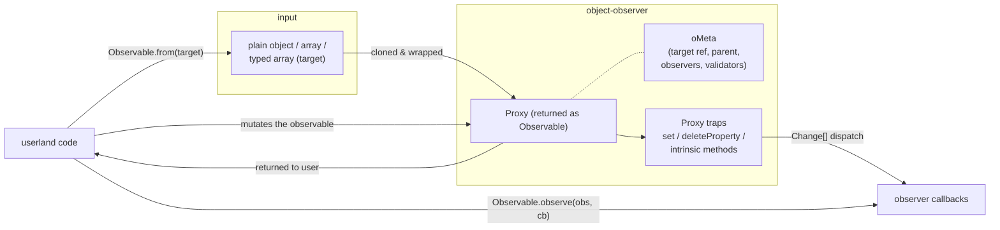

# Architecture

At its core, `object-observer` takes a userland object graph and hands back a `Proxy`-wrapped clone (the `Observable`). From that point on, consumers interact **only with the observable**; the original target stays internal. Every mutation on the observable is intercepted by the `Proxy` traps, turned into one or more `Change` events, and dispatched to the registered observers.

The returned `Observable` is deep: nested objects are themselves observables, sharing the same dispatch pipeline. Mutations anywhere in the graph bubble up through the parent chain so root-level observers see the full rooted path.
