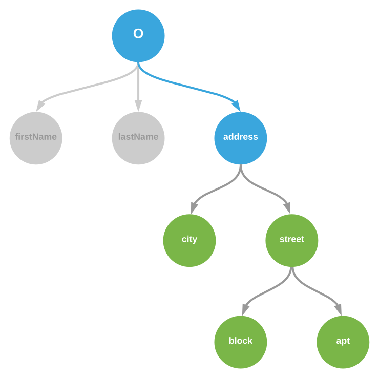
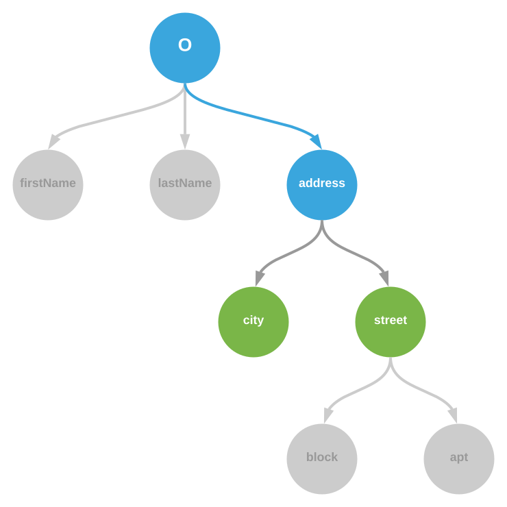

# Filter paths options

`Observable.observe(...)` allows `options` parameter, third one, optional.

Some of the options are filtering ones, allowing to specify the changes of interest from within the observable graph. Here is a detailed description of those options.

## __`pathsFrom`__

Value expected to be a non-empty string representing a path, any changes of which and deeper will be delivered to the observer.
> This option MAY NOT be used together with `path` option.

<table>
	<tr>
		<td width="50%">
			
		</td>
		<td>
			Given, that we have subscribed for the changes via:
<pre><code>Observable.observe(o, callback, { pathsFrom: 'address' });</code></pre>
			Following mutations <b>will</b> be delivered to the <code>callback</code>:
<pre><code>o.address.street.apt = 5;
o.address.city = 'DreamCity';
o.address = {};</code></pre>
			Following mutations <b>will not</b> be delivered to the <code>callback</code>:
<pre><code>o.lastName = 'Joker';</code></pre>
		</td>
	</tr>
</table>

## __`pathsOf`__

Value expected to be a string, which MAY be empty, representing a path. Changes to direct properties of which will be notified.

<table>
	<tr>
		<td width="50%">
			
		</td>
		<td>
			Given, that we have subscribed for the changes via:
<pre><code>Observable.observe(o, callback, { pathsOf: 'address' });</code></pre>
			Following mutations <b>will</b> be delivered to the <code>callback</code>:
<pre><code>o.address.street = {};
o.address.city = 'DreamCity';</code></pre>
			Following mutations <b>will not</b> be delivered to the <code>callback</code>:
<pre><code>o.lastName = 'Joker';
o.address = {};
o.address.street.apt = 5;</code></pre>
		</td>
	</tr>
</table>

## __`path`__

Value expected to be a non-empty string, representing a specific path to observe. Only a changes of this exact path will be notified.

<table>
	<tr>
		<td width="50%">
			
		</td>
		<td>
			Given, that we have subscribed for the changes via:
<pre><code>Observable.observe(o, callback, { path: 'address.street' });</code></pre>
			Following mutations <b>will</b> be delivered to the <code>callback</code>:
<pre><code>o.address.street = {};</code></pre>
			Following mutations <b>will not</b> be delivered to the <code>callback</code>:
<pre><code>o.lastName = 'Joker';
o.address = {};
o.address.street.apt = 5;</code></pre>
		</td>
	</tr>
</table>